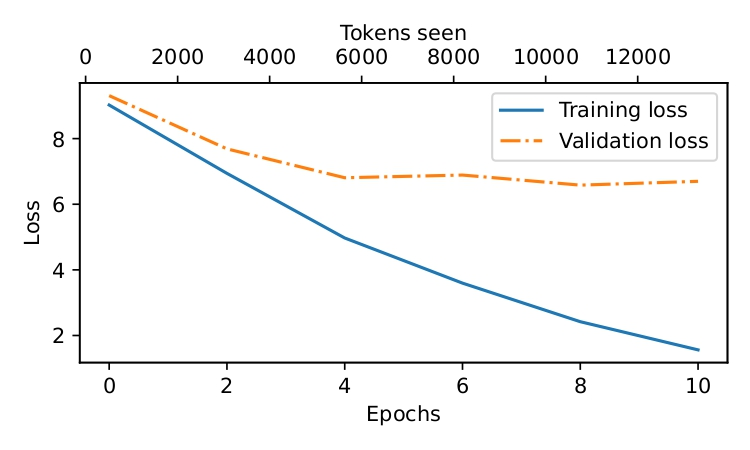
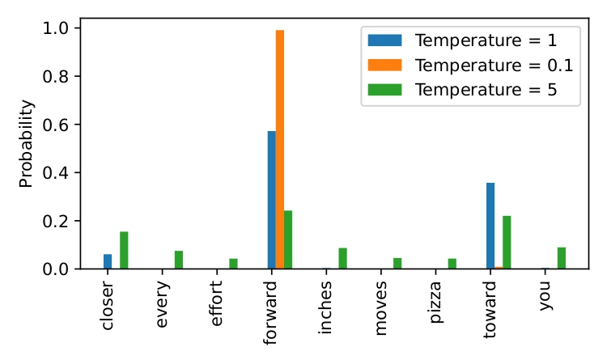

# Story-Based GPT Model Pretraining Project

This project demonstrates how to build, train, and deploy a small GPT (Generative Pre-trained Transformer) language model from scratch using PyTorch. The model is trained on a short story and can generate text in a similar style.

> **Note:** This code is adapted from Sebastian Raschka's book "Build a Large Language Model From Scratch" (2023).

## Project Overview

This project includes:

1. A custom GPT implementation with transformer architecture
2. Training pipeline with a sliding window approach
3. Text generation with temperature control and top-k sampling
4. A web interface using Chainlit for interactive text generation

## Training Results

### Loss Progression During Training



The plot above shows the training and validation loss throughout the model training process. The x-axis represents both epochs and tokens seen, while the y-axis shows the cross-entropy loss. Lower loss values indicate better performance. As training progresses, the model gradually learns to predict the next token in the story more accurately, resulting in decreasing loss values.

### Temperature Scaling Effect



This plot demonstrates how temperature scaling affects token probability distributions:
- **Low temperature (0.1)**: Creates a sharper distribution where the model consistently selects the most likely tokens, resulting in more deterministic but potentially repetitive text
- **Medium temperature (1.0)**: Provides a balanced distribution that follows the model's learned probabilities
- **High temperature (5.0)**: Creates a more uniform distribution, increasing randomness and diversity in generated text but potentially reducing coherence

Temperature scaling is a key technique implemented in the project for controlling the creativity versus coherence tradeoff in text generation.

## Project Structure

- `pretrain.ipynb`: Jupyter notebook that contains the model training code and detailed explanations
- `gpt.py`: Core GPT model implementation including architecture and training utilities
- `utils.py`: Helper functions for text generation and tokenization
- `app.py`: Chainlit web application for interactive text generation
- `dataset/story.txt`: The dataset used to train the model
- `pretrain-story-model.pth`: Pre-trained model weights

## Features

- **Custom GPT Architecture**: Implements a small but complete GPT model with multiple transformer blocks
- **Sliding Window Training**: Uses a sliding window approach to create training examples from the text
- **Decoding Strategies**: Implements temperature scaling and top-k sampling for controlled text generation
- **Interactive Interface**: Web interface for text generation using the pre-trained model

## Requirements

- Python 3.8+
- PyTorch
- tiktoken
- chainlit

## Installation

```bash
pip install torch tiktoken chainlit
```

## Usage

### Training the Model

The model training is done in the `pretrain.ipynb` notebook. You can run it to:
1. Initialize the GPT model
2. Load and prepare the text data
3. Train the model on the story dataset
4. Evaluate model performance
5. Generate text with the trained model

### Running the Web Interface

To interact with the trained model through a web interface:

```bash
chainlit run app.py
```

This will start a local web server where you can input prompts and receive generated text from the model.

## Model Configuration

The model uses the following configuration:

```python
GPT_CONFIG_124M = {
    "vocab_size": 50257,   # Vocabulary size
    "context_length": 256, # Context length
    "emb_dim": 768,        # Embedding dimension
    "n_heads": 12,         # Number of attention heads
    "n_layers": 12,        # Number of layers
    "drop_rate": 0.1,      # Dropout rate
    "qkv_bias": False      # Query-key-value bias
}
```

## Text Generation

The project implements two text generation methods:
1. **Basic generation** (`generate_text_simple`): Uses argmax to pick the most likely next token
2. **Advanced generation** (`generate`): Supports temperature scaling and top-k sampling for more diverse outputs

Example of generating text:

```python
import tiktoken
from utils import generate, text_to_token_ids, token_ids_to_text
from gpt import GPTModel
import torch

# Load model
model = GPTModel(GPT_CONFIG_124M)
model.load_state_dict(torch.load("pretrain-story-model.pth"))
model.eval()

# Generate text
tokenizer = tiktoken.get_encoding("gpt2")
token_ids = generate(
    model=model,
    idx=text_to_token_ids("Everyone knew who the Babbingtons were.", tokenizer),
    max_new_tokens=50,
    context_size=256,
    top_k=10,
    temperature=0.8
)

# Convert to text
generated_text = token_ids_to_text(token_ids, tokenizer)
print(generated_text)
```

## Learning Resources

This project demonstrates concepts like:
- Building transformer-based language models
- Cross-entropy loss and perplexity
- Implementing temperature scaling and top-k sampling
- Training language models on custom datasets

## License

This project is based on educational materials and should be used for learning purposes only.